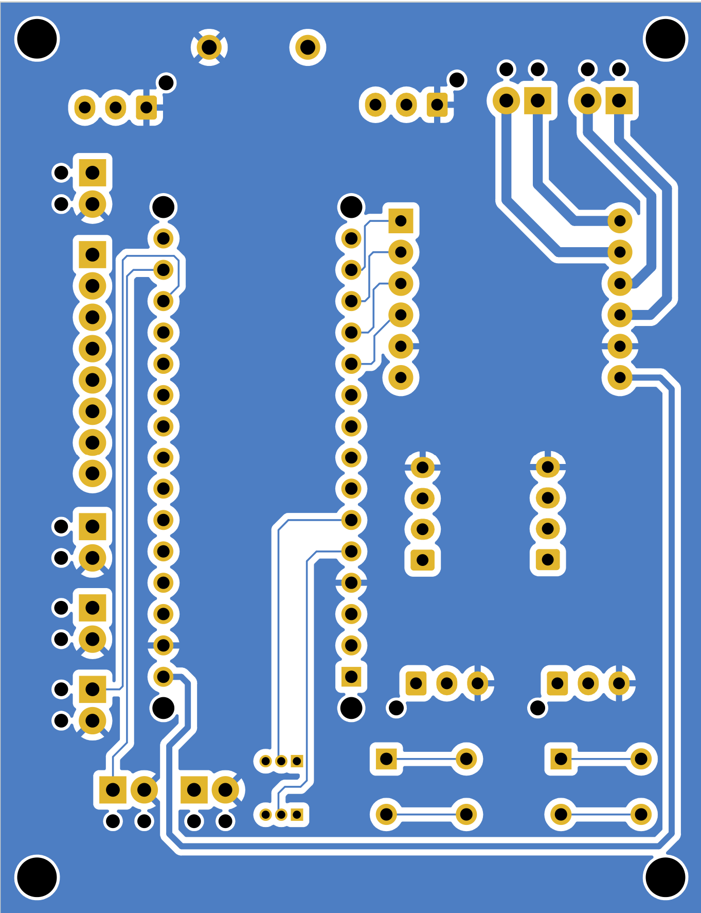

# Documentation de la carte SHIELD Arduino Nano Every

## Introduction

Cette carte à pour objectif de protéger les entrées/sorties de la carte Arduino Nano Every. Elle met aussi à disposition différentes connectiques afin de simplifier le câblage. Ses principaux avantages sont :

- Compatible avec les Arduino Nano
- Laisse accessible les tensions 3.3V/5V
- 2 boutons poussoirs pour pouvoir déclencher des actions
- Borniers à visser
- Prise en charge du driver moteur DRI0044

## Avertissement

En cas d'inversion de polarité lors du raccordement de la batterie, le fusible devra sûrement être changer. Veuillez aussi contrôler l'intégrité de la diode associée.

## Valeurs maximales

**!!! Veillez à ne jamais dépasser ces valeurs !!!**

| Nom  | Définition          | Valeur | Unité |
| :--------------- |:---------------| :-----| :-----|
| $V_{CC}$ (1) |   Tension d'alimentation de la carte        |  12 |V |
| $V_{PIN}$  | Tension injectée dans les différents connecteurs             |   5 |V |
| $I_{CC}$ (2) | Courant maximal que la carte peut consommer (avec moteurs)          |    10 |A |

(1) : Cette limite provient de la tension maximale du driver DRI0044

(2) : Le courant maximal que la carte Arduino Nano Every peut consommer est 1 A. Le reste du courant consommé est en fonction du driver moteur associé.

## Pinout

Le pinout se fait de la sorte :
- En Vert clair, les borniers permettant d'accéder au 5V ou 3V3
- En Violet, le bornier permettant d'alimenter la carte
- En Rouge, un grand bornier permettant d'accéder aux pattes analogiques de la UNO
- En Bleu foncé, les connecteurs permettant de plugger des capteurs 3 broches
- En Orange, les borniers permettant de câbler les moteurs
- En Rose, l'emplacement du driver moteur DRI0044
- En Jaune, les boutons poussoirs
- En Vert foncé, les jumpers permettant de choisir entre bouton poussoir ou capteur
- En Bleu clair, un bornier permettant de fixer la tension de référence de la conversion analogique numérique (CAN)
- En Bordeaux, les connecteurs pour les encodeurs moteurs

##### Borniers 5V ou 3V3 (Vert clair)
Il y a trois borniers à disposition pour le 5V, et un bornier pour le 3V3. Il est à noté que la tension est **toujours** située à gauche, et la masse à droite.

##### Bornier d'alimentation (Bleu clair)

La tension d'alimentation est à appliquer dans **l'entrée gauche** du bornier, et la masse à droite. Une inversion de l'entrée détruira le fusible sur la carte. Il faudra alors contacter votre enseignant.

##### Driver moteur (Rose)

Le driver moteur est connecté de la sorte :
- PWM1 = D10
- PWM2 = D9
- DIR1 = D11
- DIR2 = D8

##### Connecteurs 3 broches capteurs (Bleu foncé)

Veillez à ne pas envoyer plus de 5V et moins de 0V sur ces connecteurs. Ils sont câblés de la sorte :

Les connecteurs sont reliés à la carte Arduino de la sorte :

- SENSOR1 = D3
- SENSOR2 = D2
- SENSOR3 = D12
- SENSOR4 = D13

##### Connecteurs 4 broches encodeurs (Bordeaux)

Veillez à ne pas envoyer plus de 5V et moins de 0V sur ces connecteurs. Ils sont câblés de la sorte :

Les connecteurs sont reliés à la carte Arduino de la sorte :

- ENCODER1 A = D4
- ENCODER1 B = D5
- ENCODER2 A = D6
- ENCODER2 B = D7

##### Boutons poussoirs (Jaune)

Les boutons poussoirs sont câblés de la sorte :

- PUSHBUTTON1 = D3
- PUSHBUTTON2 = D2

Les boutons poussoirs sont fournis avec un filtre RC passe bas du premier ordre. Ce filtre permet d'éviter les rebonds. Il n'est donc pas nécessaire de prévoir un délai logiciel ou un filtre à part pour utiliser ces boutons. Il est intéressant de remarquer que les boutons sont câblés sur les mêmes pins que SENSOR1 et SENSOR2. Pour gérer cela, des jumpers sont à disposition.

##### Jumpers (Vert foncé)

Les jumpers permettent de choisir si l'on souhaite utiliser un bouton poussoir ou un connecteur capteur 3 broches. Il suffit de placer le jumper à droite pour utiliser le bouton associé, et à gauche pour utiliser le connecteur associé.

Le JUMPER1 permet de choisir entre PUSHBUTTON1 et SENSOR1, tandis que le JUMPER2 permet de choisir entre PUSHBUTTON2 et SENSOR2.

Il n'est pas possible d'utiliser un PUSHBUTTON1 et SENSOR1, ou PUSHBUTTON2 et SENSOR2 simultanément.

##### Borniers x8 (Rouge)

Ce bornier permet de communiquer avec les pattes analogiques de l'Arduino Uno Every. Il est aussi possible d'utiliser ces pattes comme des entrées/sorties digitales. Il est cependant important de **ne pas** dépasser 5 V sur ces pins.

## Dimensions

## Protection des entrées/sorties

Afin de protéger les entrées/sorties, des diodes Schottky ont étés placées entre le pin et le +5 V, et entre le pin et la masse. Cette solution permet de limiter la tension d'entrée à 5 V, et empêche les tensions négatives. Une résistance de 270 $\Omega$ à été placée en série, afin de limiter le courant en cas de court-circuit.

## Bill Of Materials (BOM)

| Designator  | Nom          | Valeur | Package |
| :--------------- |:---------------| :-----| :-----|
| R1 |   FRC1210J271 TS        |  270 $\Omega$ |1210 |
| R2 |   FRC1210J271 TS        |  270 $\Omega$ |1210 |
| R3 |   FRC1210J271 TS        |  270 $\Omega$ |1210 |
| R4 |   FRC1210J271 TS        |  270 $\Omega$ |1210 |
| R5 |   FRC1210J271 TS        |  270 $\Omega$ |1210 |
| R6 |   FRC1210J271 TS        |  270 $\Omega$ |1210 |
| R7 |   FRC1210J271 TS        |  270 $\Omega$ |1210 |
| R8 |   FRC1210J271 TS        |  270 $\Omega$ |1210 |
| R9 |   FRC1210J271 TS        |  270 $\Omega$ |1210 |
| R10 |   FRC1210J271 TS        |  270 $\Omega$ |1210 |
| R11 |   FRC1210J271 TS        |  270 $\Omega$ |1210 |
| R12 |   FRC1210J271 TS        |  270 $\Omega$ |1210 |
| R13 |   FRC1210J271 TS        |  270 $\Omega$ |1210 |
| R14 |   FRC1210J271 TS        |  270 $\Omega$ |1210 |
| R15 |   FRC1210J271 TS        |  270 $\Omega$ |1210 |
| R16 |   FRC1210J271 TS        |  270 $\Omega$ |1210 |
| R17 |   CR1206J40114G        |  110k $\Omega$ |1206 |
| R18 |   FRP1206J103 TS       |  10k $\Omega$ |1206 |
| R19 |   CR1206J40114G        |  110k $\Omega$ |1206 |
| R20 |   FRP1206J103 TS      |  10k $\Omega$ |1206 |
| D1 |   B0540W      | B0540W |SOD-123 |
| D2 |   B0540W      | B0540W |SOD-123 |
| D3 |   B0540W      | B0540W |SOD-123 |
| D4 |   B0540W      | B0540W |SOD-123 |
| D5 |   B0540W      | B0540W |SOD-123 |
| D6 |   B0540W      | B0540W |SOD-123 |
| D7 |   B0540W      | B0540W |SOD-123 |
| D8 |   B0540W      | B0540W |SOD-123 |
| D9 |   B0540W      | B0540W |SOD-123 |
| D10 |   B0540W      | B0540W |SOD-123 |
| D11 |   B0540W      | B0540W |SOD-123 |
| D12 |   B0540W      | B0540W |SOD-123 |
| D13 |   B0540W      | B0540W |SOD-123 |
| D14 |   B0540W      | B0540W |SOD-123 |
| D15 |   B0540W      | B0540W |SOD-123 |
| D16 |   B0540W      | B0540W |SOD-123 |
| D17 |   B0540W      | B0540W |SOD-123 |
| D18 |   B0540W      | B0540W |SOD-123 |
| D19 |   B0540W      | B0540W |SOD-123 |
| D20|   B0540W      | B0540W |SOD-123 |
| D21 |   B0540W      | B0540W |SOD-123 |
| D22 |   B0540W      | B0540W |SOD-123 |
| D23 |   B0540W      | B0540W |SOD-123 |
| D24 |   B0540W      | B0540W |SOD-123 |
| D25 |   B0540W      | B0540W |SOD-123 |
| D26 |   B0540W      | B0540W |SOD-123 |
| D27 |   B0540W      | B0540W |SOD-123 |
| D28 |   B0540W      | B0540W |SOD-123 |
| D29 |   B0540W      | B0540W |SOD-123 |
| D30 |   B0540W      | B0540W |SOD-123 |
| D31 |   1N4001      | 1N4001 |DO-41 |
| D32 |   B0540W      | B0540W |SOD-123 |
| D33 |   B0540W      | B0540W |SOD-123 |
| C1 | FN15X103J500PNG | 10 nF | 0402 |
| C2 | FN15X103J500PNG | 10 nF | 0402 |
| J1 | B3B-XH-AM(LF)(SN) | B3B-XH-AM(LF)(SN) | Plugin,P=2.5mm |
| J2 | B3B-XH-AM(LF)(SN) | B3B-XH-AM(LF)(SN) | Plugin,P=2.5mm |
| J3 | B3B-XH-AM(LF)(SN) | B3B-XH-AM(LF)(SN) | Plugin,P=2.5mm |
| J4 | TY308-2.54-02P-14-00AH | TY308-2.54-02P-14-00AH | Plugin,P=2.54mm |
| J6 | TY308-2.54-02P-14-00AH | TY308-2.54-02P-14-00AH | Plugin,P=2.54mm |
| J7 | B04B-XASK-1(LF)(SN) | B04B-XASK-1(LF)(SN) | Plugin,P=2.5mm |
| J8 | MP008517 | MP008517 | Plugin,P=2.54mm |
| J9 | TY308-2.54-02P-14-00AH | TY308-2.54-02P-14-00AH | Plugin,P=2.54mm |
| J10 | B04B-XASK-1(LF)(SN) | B04B-XASK-1(LF)(SN) | Plugin,P=2.5mm |
| J11 | TY308-2.54-02P-14-00AH | TY308-2.54-02P-14-00AH | Plugin,P=2.54mm |
| J12 | TY308-2.54-02P-14-00AH | TY308-2.54-02P-14-00AH | Plugin,P=2.54mm |
| J13 | B3B-XH-AM(LF)(SN) | B3B-XH-AM(LF)(SN) | Plugin,P=2.5mm |
| J14 | M50-1920005 |M50-1920005 | Plugin,P=1.27mm |
| J15 | M50-1920005 | M50-1920005 | Plugin,P=1.27mm |
| J17 | TY308-2.54-02P-14-00AH | TY308-2.54-02P-14-00AH | Plugin,P=2.54mm |
| J18 | TY308-2.54-02P-14-00AH | TY308-2.54-02P-14-00AH | Plugin,P=2.54mm |
| J19 | TY308-2.54-02P-14-00AH | TY308-2.54-02P-14-00AH | Plugin,P=2.54mm |
| F1 | 01550900M | 01550900M |SMD,5.0x9.7mm |
| SW1 | B3F-1020 | B3F-1020 |6mm x 6mm |
| SW2 | B3F-1020 | B3F-1020 |6mm x 6mm |
| A1 |ARDUINO NANO EVERY | ARDUINO NANO EVERY |Plugin,P=2.54mm |
| U1 |DRI0044 | DRI0044 |Plugin,P=2.54mm |

## PCB Layout
>**Top Layout**

>**Bottom Layout**

## Schematic

>**Schematic KiCAD**

## Liens utiles

- https://docs.arduino.cc/resources/datasheets/ABX00028-datasheet.pdf
- https://www.mouser.be/pdfDocs/DRI0044_Web.pdf

